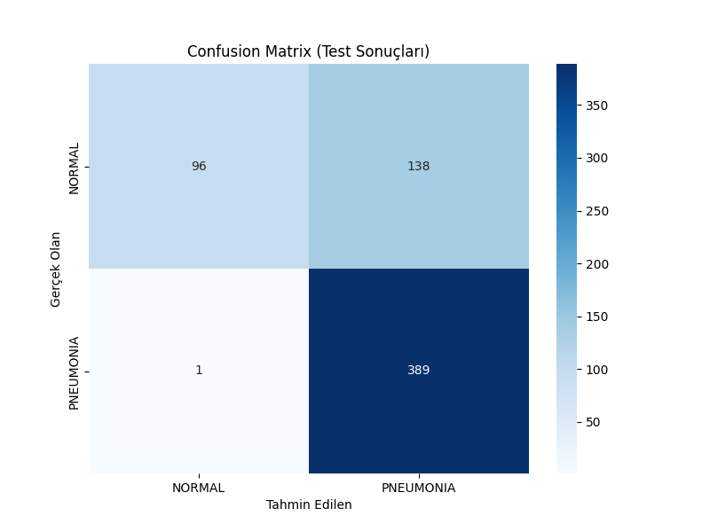
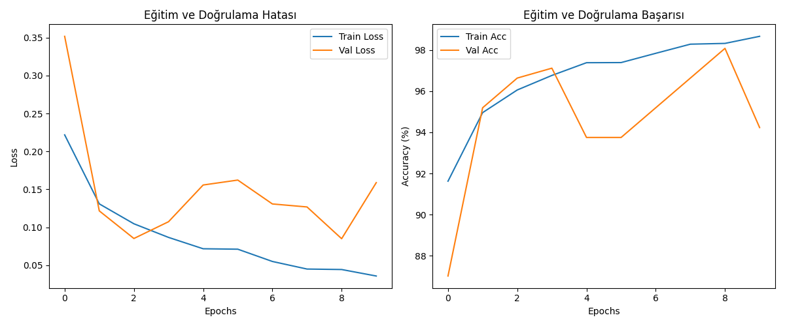

# 🩻 XRayCNN: Derin Öğrenme ile Zatürre (Pnömoni) Tespiti



## 📌 Proje Özeti
**XRayCNN**, göğüs röntgeni (Chest X-Ray) görüntülerinden Pnömoni teşhisini yüksek hassasiyetle yapabilen, derin öğrenme tabanlı bir karar destek sistemidir. Tıbbi tanılarda hayati risk taşıyan "hastalığı gözden kaçırma" (False Negative) durumunu minimize etmek projenin ana odak noktasıdır.

Veri setindeki ciddi **Sınıf Dengesizliği (Class Imbalance)** sorununu çözmek için özel bir **Offline Augmentation Pipeline** geliştirilmiş ve literatüre dayalı, özgün bir CNN mimarisi sıfırdan tasarlanmıştır.

📄 **Detaylı teknik raporu incelemek için tıklayın:** [Proje Raporu (PDF/DOCX)](proje_raporu.txt)

## 📂 Veri Seti Yapılandırması (Dataset Split)
Proje başlangıcında, modelin gerçek dünya performansını ölçmek için **Train** klasöründeki Normal ve Pnömoni sınıflarından **96'şar adet fotoğraf** alınarak **Test** klasörüne taşınmıştır. Veri sayıları bu işleme göre oluşmuştur:

* **Test:**
    * Normal: **234**
    * Pneumonia: **390**
* **Train:**
    * Normal: **1245** (Hedef: 8000 - *Kod ile halledildi*)
    * Pneumonia: **3779** (Hedef: 8000 - *Kod ile halledildi*)
* **Validation (Valid):**
    * Normal: **104**
    * Pneumonia: **104**

## 🚀 Temel Özellikler
* **Özgün XRayCNN Mimarisi:** Tıbbi doku analizi için optimize edilmiş, kararlılık için `BatchNormalization` ve `Dropout` katmanları içeren özel Konvolüsyonel Sinir Ağı.
* **Gelişmiş Ön İşleme (Pipeline-2):**
    * **CLAHE:** Akciğerdeki silik "buzlu cam" (ground-glass) opaklıklarını belirginleştirmek için kontrast eşitleme uygulandı.
    * **Gri Tonlama:** Renk gürültüsünü atıp sadece morfolojik yapıya odaklanıldı.
* **Dengesizlik Yönetimi:** Veri setini dengelemek için stratejik bir veri çoğaltma işlemi (Rotasyon, Kaydırma, Kontrast) uygulandı.

## 📊 Performans Sonuçları

Model, **NVIDIA RTX 3050** GPU üzerinde 10 Epoch boyunca eğitilmiştir.

| Metrik | Skor | Klinik Anlamı |
| :--- | :--- | :--- |
| **Doğrulama Başarısı (Val Acc)** | **%98.08** | Görülmemiş doğrulama verisinde yüksek güvenilirlik. |
| **Test Duyarlılığı (Recall)** | **1.00** | **390 zatürre hastasından 389'u doğru tespit edildi.** |
| **Test Doğruluğu** | %78 | Ön tarama araçları için kabul edilebilir hassasiyet takası. |

### Karmaşıklık Matrisi (Confusion Matrix) Analizi
Model, **"Zero-Miss" (Sıfır Hata)** eğilimi göstermektedir. Test setinde sadece 1 hastayı kaçırmış, buna karşılık 138 sağlıklı bireyi riskli olarak işaretlemiştir.



## 🛠️ Kurulum ve Kullanım

### 1. Projeyi Klonlayın
```bash
git clone [https://github.com/aysegulucan/XRayCNN-Pneumonia-Detection.git](https://github.com/aysegulucan/XRayCNN-Pneumonia-Detection.git)
cd XRayCNN-Pneumonia-Detection
````

### 2\. Gerekli Kütüphaneleri Kurun

```bash
pip install -r requirements.txt
```

### 3\. Veri Setini Hazırlayın

[Chest X-Ray Images (Pneumonia)](https://www.kaggle.com/datasets/paultimothymooney/chest-xray-pneumonia) veri setini indirin.
Dosyaları ana dizindeki `data/` klasörüne şu yapıda çıkarın:

  * `data/train`
  * `data/val`
  * `data/test`

### 4\. Modeli Eğitin
Not: Eğitim sonucu oluşan model dosyası (best_model.pth) yaklaşık 100MB olduğu için GitHub deposuna eklenemedi. Bu nedenle modeli kendiniz eğiterek oluşturmanız gerekmektedir. Eğitim tamamlandığında otomatik olarak kaydedilecektir.

Sıfırdan eğitim başlatmak için:

```bash
python src/train.py
```

### 5\. Test Edin

En iyi kaydedilen modeli test setinde denemek için:

```bash
python src/test_model.py
```

## 🧠 Model Mimarisi Özeti

  * **Girdi:** (3, 224, 224) RGB Görüntü (Dahili olarak Gri Tonlamaya çevrilir)
  * **Omurga:** 3x3 Konvolüsyon katmanlarına sahip 4 Bloklu CNN
  * **Regülarizasyon:** Batch Normalization + Dropout (0.5)
  * **Optimizasyon:** Adam (LR=0.0001)
  * **Kayıp Fonksiyonu:** BCEWithLogitsLoss

-----

**Ayşegül Uçan** 
*Endüstri Mühendisliği Öğrencisi*

```
```
